# fltk-theme

A theming crate for fltk-rs, based on work by [Remy Oukaour](https://github.com/roukaour/viz-brain-visualizer) and [Greg Ercolano](https://groups.google.com/g/fltkgeneral/c/3A5VC_854ok/m/sDpJsmuLBAAJ).

## Usage
```toml
[dependencies]
fltk = "1.1.4"
fltk-theme = "0.1"
```

## Example

Setting the color theme:

```rust
use fltk::{prelude::*, *};
use fltk_theme::{ColorTheme, color_themes};

fn main() {
    let a = app::App::default().with_scheme(app::Scheme::Gtk);
    let theme = ColorTheme::from_colormap(color_themes::BLACK_THEME);
    theme.apply();
    let mut win = window::Window::default().with_size(400, 300);
    let mut btn = button::Button::new(160, 200, 80, 40, "Hello");
    btn.set_color(btn.color().lighter());
    win.end();
    win.show();
    a.run().unwrap();
}
```

Setting the widget theme:

```rust
use fltk::{prelude::*, *};
use fltk_theme::{widget_themes, WidgetTheme, ThemeType};

fn main() {
    let a = app::App::default();
    let widget_theme = WidgetTheme::new(ThemeType::Aqua);
    widget_theme.apply();
    let mut win = window::Window::default().with_size(400, 300);
    let mut btn = button::Button::new(160, 200, 80, 30, "Hello");
    btn.set_frame(widget_themes::OS_DEFAULT_BUTTON_UP_BOX);
    win.end();
    win.show();
    a.run().unwrap();
}
```

## Widget themes

- Classic (old Windows theme)
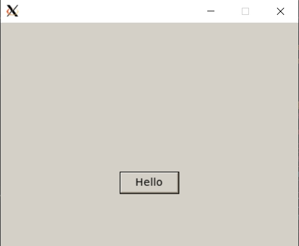

- Aero (Windows 7 theme)
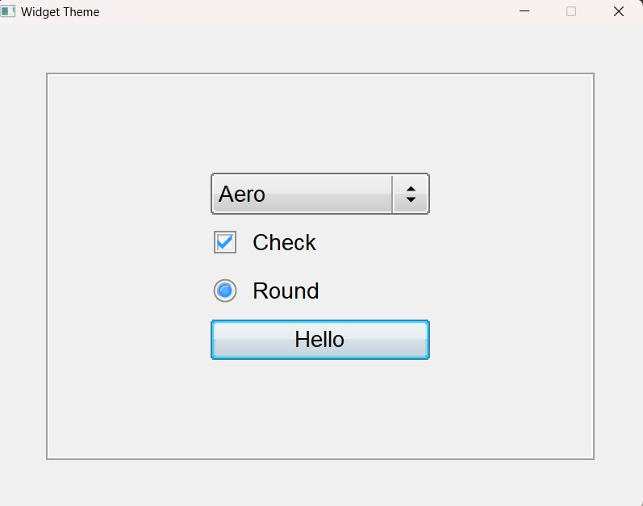

- Aqua (MacOS theme)
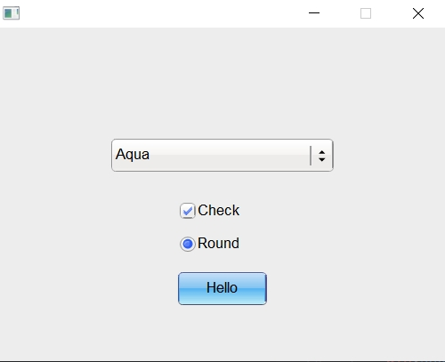

- Dark
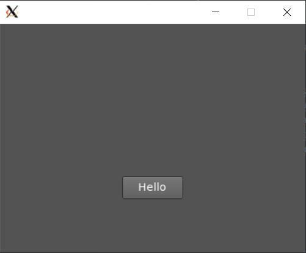

- High Contrast
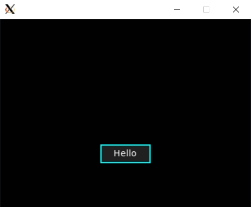

- Blue
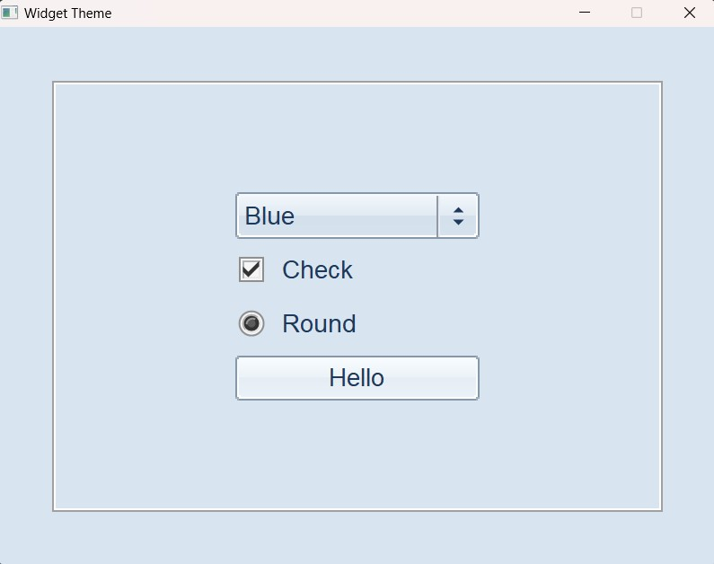

- Metro (Windows 8 theme)
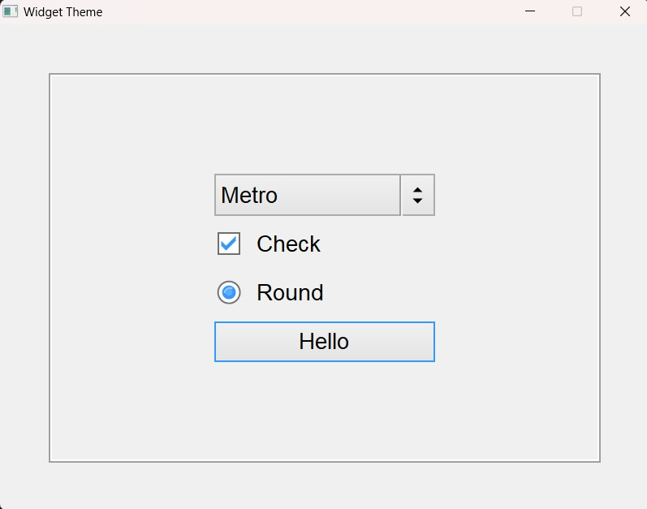

- Greybird (Gnome xfce)
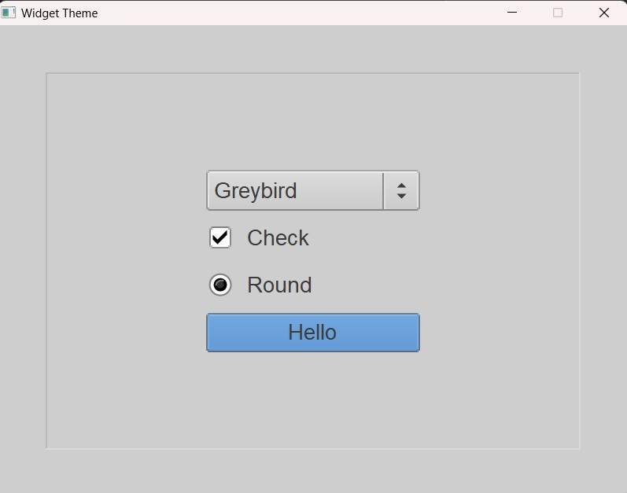


## Color themes

- Black theme
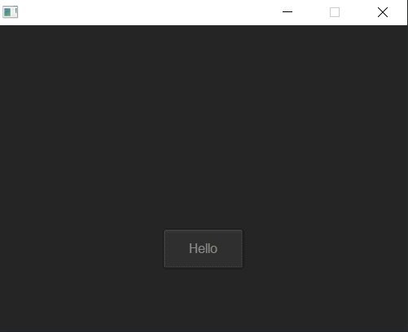

- Dark theme
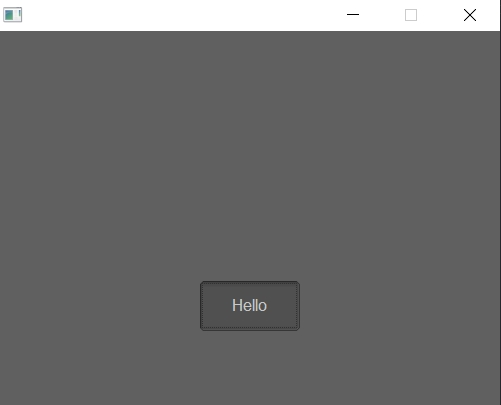

- Plain gray theme
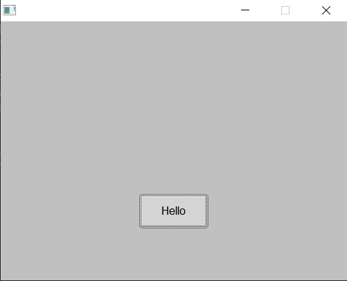

- Tan theme
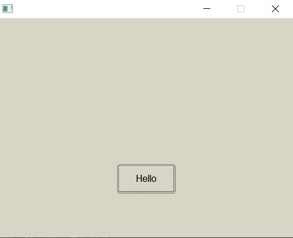

- Shake theme
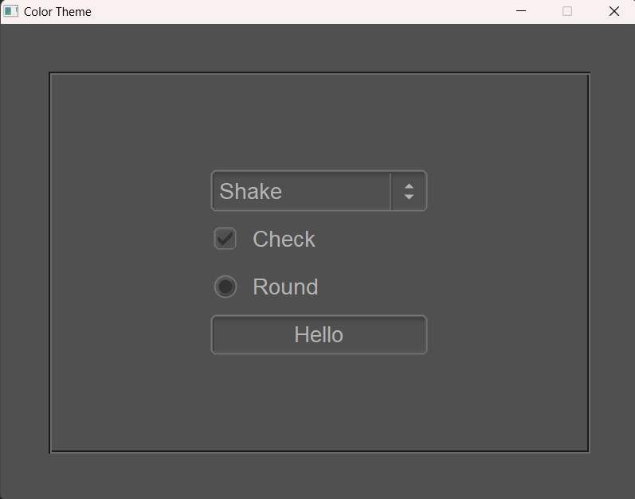
