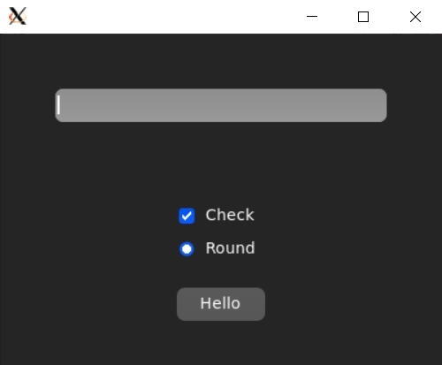
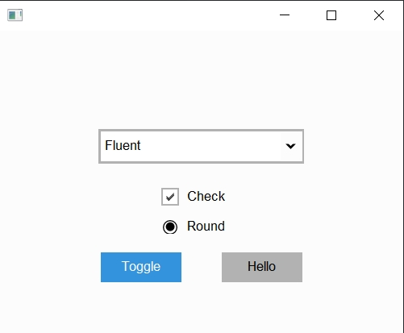
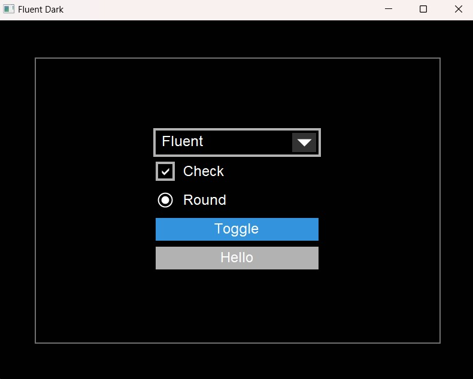
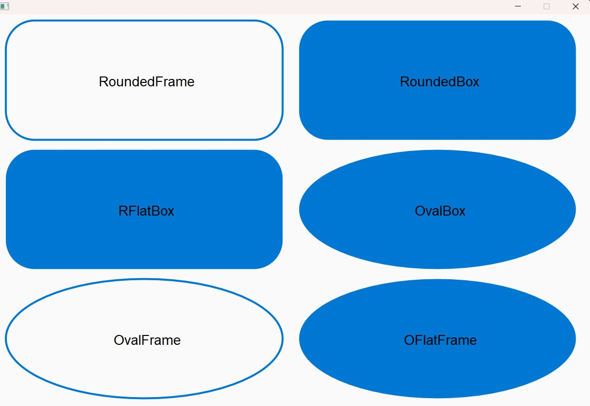
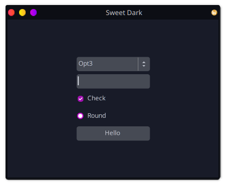
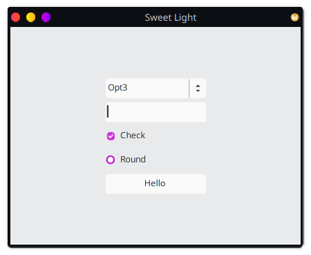

# fltk-theme

A theming crate for fltk-rs.
- The widget themes are based on work by [Remy Oukaour](https://github.com/roukaour/viz-brain-visualizer) and [Rangi42](https://github.com/Rangi42/tilemap-studio).
- The color themes are based on work by [Greg Ercolano](https://groups.google.com/g/fltkgeneral/c/3A5VC_854ok/m/sDpJsmuLBAAJ).
- The fleet color themes are based on [CyprinusCarpio FLEET library](https://github.com/CyprinusCarpio/fleet).
- Some of the widget schemes are based on work by the NTK GUI library, the fleet schemes are based on the [FLEET library](https://github.com/CyprinusCarpio/fleet). Others are nouveau.

## Definitions

### Color theme
- A color theme modify FLTK's color map without modifying any of the drawing routines of the widgets.

### Widget scheme
- A widget scheme modifies FLTK's drawing routines for widgets, thus changing their appearance, without changing their colors.

### Widget theme
- A widget theme modifies FLTK's drawing routines for widgets, as well as the color map, or default colors used for drawing widgets.

As such, color themes can be combined with widget schemes. Widget schemes also enable individually changing the colors and selection colors of each widget. While widget themes have a fixed coloring for widgets, and these usually follow the theme they're named after.

## Usage
```toml
[dependencies]
fltk = "1.4"
fltk-theme = "0.7"
```

## Example

Setting the color theme:

```rust,no_run
use fltk::{prelude::*, *};
use fltk_theme::{ColorTheme, color_themes};

fn main() {
    let a = app::App::default().with_scheme(app::Scheme::Gtk);
    let theme = ColorTheme::new(color_themes::BLACK_THEME);
    theme.apply();
    let mut win = window::Window::default().with_size(400, 300);
    let mut btn = button::Button::new(160, 200, 80, 40, "Hello");
    btn.set_color(btn.color().lighter());
    win.end();
    win.show();
    a.run().unwrap();
}
```

Setting the widget theme:

```rust,no_run
use fltk::{prelude::*, *};
use fltk_theme::{widget_themes, WidgetTheme, ThemeType};

fn main() {
    let a = app::App::default();
    let widget_theme = WidgetTheme::new(ThemeType::AquaClassic);
    widget_theme.apply();
    let mut win = window::Window::default().with_size(400, 300);
    let mut btn = button::Button::new(160, 200, 80, 30, "Hello");
    btn.set_frame(widget_themes::OS_DEFAULT_BUTTON_UP_BOX);
    win.end();
    win.show();
    a.run().unwrap();
}
```

Setting the widget scheme:
```rust,no_run
use fltk::{prelude::*, *};
use fltk_theme::{WidgetScheme, SchemeType};

fn main() {
    let a = app::App::default();
    let widget_scheme = WidgetScheme::new(SchemeType::Clean);
    widget_scheme.apply();
    let mut win = window::Window::default().with_size(400, 300);
    let mut btn = button::Button::new(160, 200, 80, 30, "Hello");
    win.end();
    win.show();
    a.run().unwrap();
}
```


## Color themes

- Black theme
- 

- Dark theme
- 

- Plain gray theme
- 

- Tan theme
- 

- Shake theme
- 

- Fleet themes (From the excellent [FLEET library](https://github.com/CyprinusCarpio/fleet)):
    - GRUVBOX_DARK
    - 

    - DRACULA
    - 

    - PURPLE_DUSK
    - 

    - MONOKAI
    - 

    - CYBERPUNK
    - 

    - SOLARIZED_DARK
    - 

    - MATERIAL_DARK
    - 

    - And others.

## Widget themes

- Classic (old Windows theme)
- 

- Aero (Windows 7 theme)
- 

- AquaClassic (classic MacOS theme),
- 

- Dark
- 

- High Contrast
- 

- Blue
- 

- Metro (Windows 8 theme)
- 

- Greybird (Gnome xfce)
- 

## Theme FrameTypes

Choosing a WidgetTheme will also define a set of FrameTypes which can be used for your widgets.
```ignore
OS_BUTTON_UP_BOX
OS_CHECK_DOWN_BOX
OS_BUTTON_UP_FRAME
OS_CHECK_DOWN_FRAME
OS_PANEL_THIN_UP_BOX
OS_SPACER_THIN_DOWN_BOX
OS_PANEL_THIN_UP_FRAME
OS_SPACER_THIN_DOWN_FRAME
OS_RADIO_ROUND_DOWN_BOX
OS_HOVERED_UP_BOX
OS_DEPRESSED_DOWN_BOX
OS_HOVERED_UP_FRAME
OS_DEPRESSED_DOWN_FRAME
OS_INPUT_THIN_DOWN_BOX
OS_INPUT_THIN_DOWN_FRAME
OS_MINI_BUTTON_UP_BOX
OS_MINI_DEPRESSED_DOWN_BOX
OS_MINI_BUTTON_UP_FRAME
OS_MINI_DEPRESSED_DOWN_FRAME
OS_DEFAULT_BUTTON_UP_BOX
OS_DEFAULT_HOVERED_UP_BOX
OS_DEFAULT_DEPRESSED_DOWN_BOX
OS_TOOLBAR_BUTTON_HOVER_BOX
OS_TABS_BOX
OS_SWATCH_BOX
OS_SWATCH_FRAME
OS_BG_BOX
```

You can check the frames example to see all `FrameType`'s you can apply to you widgets.

## Widget Schemes

These provide schemes for widgets without color theming. Currently there are 7 schemes:
- Clean: Taken from NTK's clear scheme.
- 

- Aqua: Tries to mimic the modern MacOS's styles.
- 
- 

- Fluent: Tries to mimic Window's 10 styles.
- 
- 

- SvgBased: This overrides FLTK's Base scheme round/rounded/oval FrameTypes which are drawn using scalable vector graphics.
- 

- Sweet: Tries to mimic the Sweet theme for GNOME/KDE.
- 
- 

- Fleet1: A 3D scheme designed for good looks in both dark and light colors.
- Fleet2: A gradient scheme designed for good looks in both dark and light colors.

## Colors

The crate also provides colors, namely html colors and aqua colors.
The aqua colors are provided as static values and are named after the cocoa NSColor properties (such as windowBackgroundColor, systemBlueColor, controlAccentColor...etc). The html colors are provided in a static HashMap and can be accessed by their [html names](https://www.w3schools.com/tags/ref_colornames.asp). Refer to the html_colors and aqua_dark examples to see how the colors are used.

Colors and Color themes can also be used with widget schemes or even in a regular fltk-rs application.
